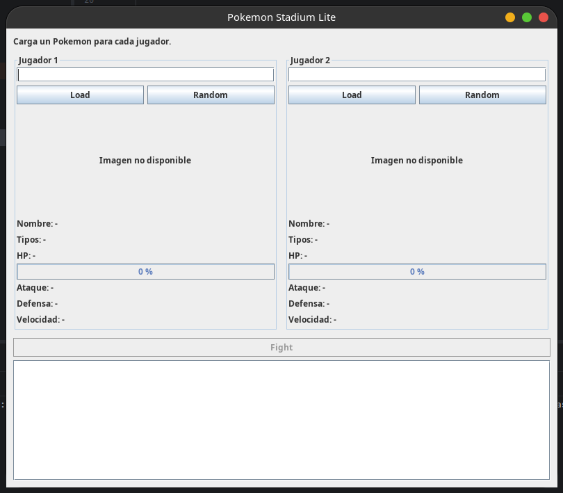
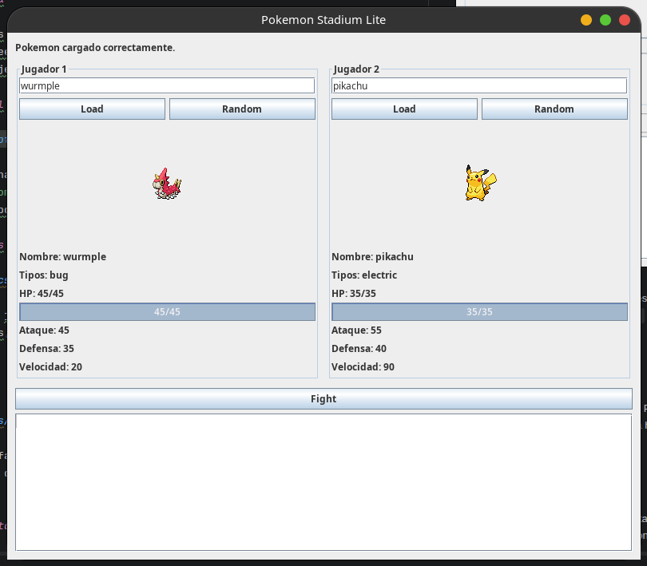
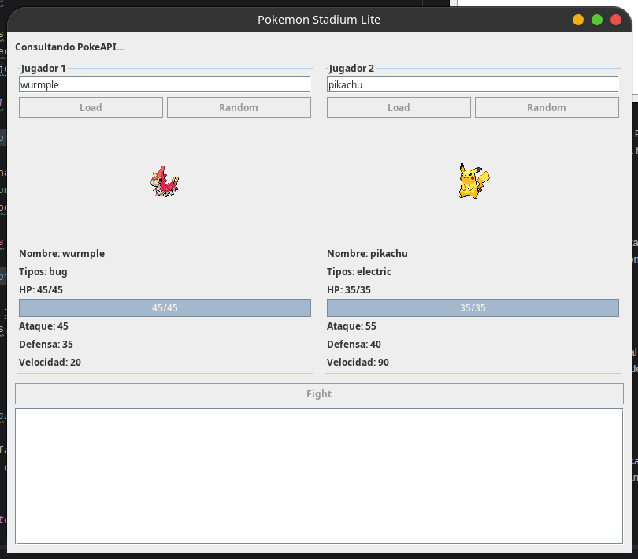
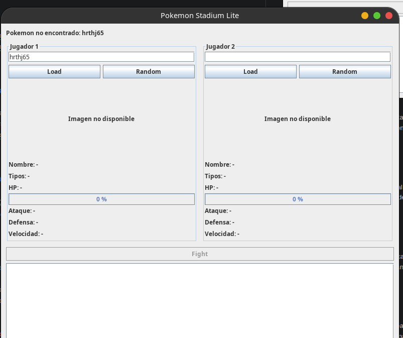
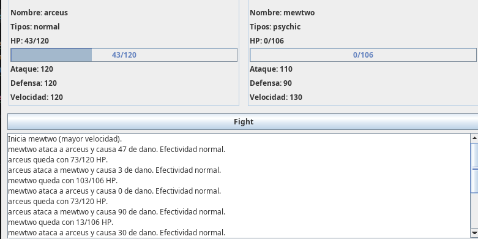
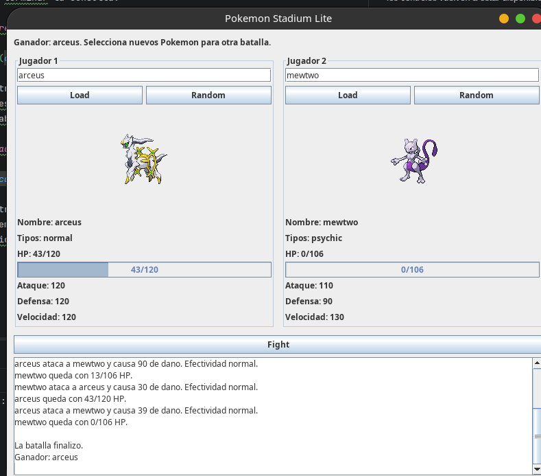

# Pokemon Stadium Lite

Miniaplicacion Java para consultar Pokemon en PokeAPI y simular combates por turnos.

## Requisitos

- Java 11 o superior.
- Conexion a internet para consultar PokeAPI.
- IntelliJ IDEA recomendado para abrir y editar `src/PokeApiGUI.form`.

## Instrucciones de ejecucion

### Ejecutar desde IntelliJ IDEA

1. Abrir la carpeta raiz del proyecto.
2. Verificar que el SDK del proyecto sea Java 11 o superior.
3. Confirmar que `src` este configurado como directorio de fuentes.
4. Abrir `src/PokeApiGUI.java`.
5. Ejecutar el metodo `main` de `PokeApiGUI`.

Tambien puede ejecutarse la configuracion de aplicacion `PokeApiGUI` que ya esta
configurada en el proyecto. La interfaz utiliza `PokeApiGUI.form` como referencia
visual y la ventana se crea con Swing.

### Compilar y ejecutar desde la terminal

Desde la raiz del proyecto:

```bash
rm -rf /tmp/lab-ds3-classes
mkdir -p /tmp/lab-ds3-classes
javac -cp 'lib/*' -d /tmp/lab-ds3-classes src/*.java
java -cp '/tmp/lab-ds3-classes:lib/*' PokeApiGUI
```

Se necesita conexion a internet para usar los botones `Load` y `Random`.

### Ejecutar las pruebas de logica

```bash
java -ea -cp '/tmp/lab-ds3-classes:lib/*' BattleLogicTest
```

Salida esperada:

```text
BattleLogicTest: todas las pruebas pasaron
```

Las pruebas cubren el modelo `Pokemon`, HP, velocidad, desempate, dano minimo,
golpes criticos, efectividad de tipos, finalizacion y notificacion del ganador.

### Ejecutar consultas desde consola

La clase `PokeApi` permite probar el cliente sin abrir la interfaz:

```bash
java -cp '/tmp/lab-ds3-classes:lib/*' PokeApi pikachu
```

## Breve explicacion del diseno

El proyecto separa el modelo, la comunicacion con PokeAPI, la logica de batalla
y la interfaz grafica. `Pokemon` representa los datos y el estado de HP;
`PokeApiClient` realiza y valida las consultas HTTP; `Battle` contiene las reglas
del combate sin depender de Swing; y `BattleListener` comunica los turnos, los
cambios de HP y el ganador a la interfaz.

`PokeApiGUI` coordina la experiencia de usuario para dos jugadores. Las consultas
a PokeAPI y la ejecucion de la batalla se realizan con `SwingWorker` para no
bloquear el hilo de eventos de Swing. Los eventos recibidos por la GUI se aplican
con `SwingUtilities.invokeLater`, actualizando el registro, las barras de HP,
los mensajes de estado y el ganador. Los controles se deshabilitan durante las
operaciones para evitar acciones repetidas o estados inconsistentes.

## Modelo y API

`Pokemon` conserva los datos basicos devueltos por PokeAPI, incluyendo nombre,
tipos, sprite, estadisticas, HP maximo y HP actual. El HP se restaura al iniciar
una batalla y nunca puede quedar por debajo de cero.

`PokeApiClient` consulta solo lectura el endpoint:

```text
https://pokeapi.co/api/v2/pokemon/{name}
```

Acepta nombres normalizados y consultas aleatorias por identificador. Los errores
de red, respuestas HTTP no exitosas, Pokemon inexistentes y JSON incompleto se
entregan como `PokeApiException` para que la interfaz los muestre sin cerrar la
aplicacion.

## Reglas del combate

- Comienza el Pokemon con mayor velocidad.
- Si empatan, el inicio se elige aleatoriamente.
- Se usa el primer tipo de cada Pokemon para la efectividad.
- Agua contra Fuego, Fuego contra Planta y Planta contra Agua aplican `x1.3`.
- Las relaciones inversas aplican `x0.7`; los demas casos aplican `x1.0`.
- La probabilidad de golpe critico es 10% y su multiplicador es `x1.5`.
- La interfaz informa si el primer turno se decidio por mayor velocidad o por
  desempate aleatorio.
- La formula implementada es:

```text
danoBase = ataqueAtacante * random(0, 1)
          - defensaDefensor * random(0, 1)

dano = redondear(max(0, danoBase * modificadorTipo * modificadorCritico))
```

El dano aplicado se comunica mediante `BattleListener`, junto con los cambios
de HP y el ganador. `Battle` no depende de componentes Swing.

## Capturas de pantalla

Las siguientes capturas deben tomarse ejecutando la aplicacion desde IntelliJ
o desde la terminal. Reemplaza cada marcador por el archivo de imagen
correspondiente, por ejemplo `docs/capturas/01-interfaz-inicial.png`.

### 1. Interfaz inicial



**Descripcion:** ventana con los dos paneles de jugadores, campos de busqueda,
botones `Load` y `Random`, barras de HP vacias, registro de batalla y boton
`Fight` deshabilitado porque aun no hay dos Pokemon cargados.

### 2. Pokemon cargados



**Descripcion:** ambos jugadores tienen un Pokemon cargado. Se observan los
sprites, nombres, tipos, estadisticas, HP maximo y actual. El boton `Fight`
queda habilitado.

### 3. Estado de carga



**Descripcion:** interfaz mientras se consulta PokeAPI. Se muestra el mensaje
de carga y los botones de seleccion permanecen deshabilitados para evitar
consultas repetidas.

### 4. Error de consulta



**Descripcion:** mensaje visible producido al buscar un nombre vacio, invalido
o inexistente. La ventana permanece abierta y los controles vuelven a estar
disponibles despues de terminar la consulta.

### 5. Batalla en progreso



**Descripcion:** registro con los turnos, atacante, defensor, dano, efectividad,
golpes criticos y HP restante. Las barras de HP reflejan el dano recibido y
`Fight` permanece deshabilitado durante la batalla.

### 6. Batalla finalizada



**Descripcion:** registro mostrando que la batalla finalizo y anunciando el
ganador. El HP del Pokemon derrotado llega a cero y se permite seleccionar
nuevos Pokemon para iniciar otra batalla.
